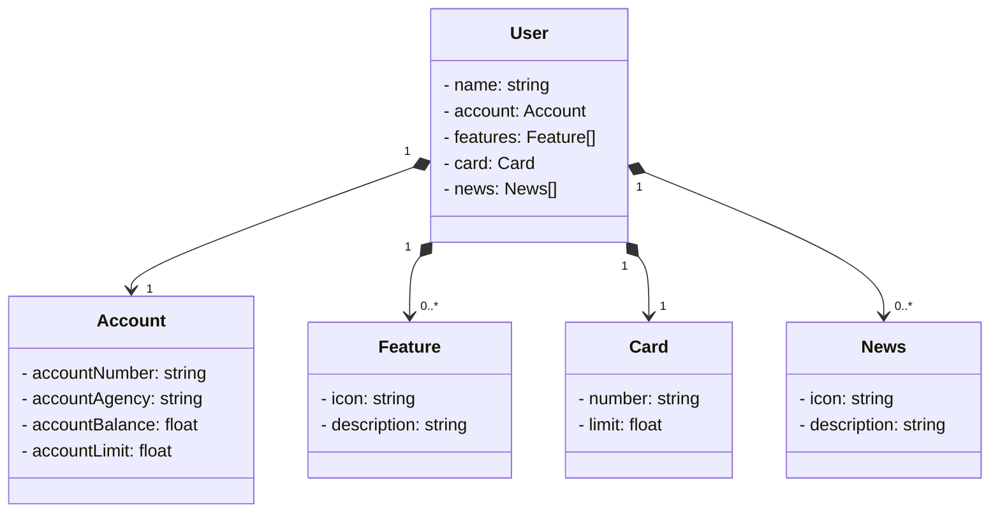

# Bootcamp Santander Angular + JAVA
Java RESTful API criada para o desafio API REST do Bootcamp Santander na DIO

## Diagrama de Classes

```mermaid
classDiagram
    class User {
        - name: string
        - account: Account
        - features: Feature[]
        - card: Card
        - news: News[]
    }

    class Account {
        - accountNumber: string
        - accountAgency: string
        - accountBalance: float
        - accountLimit: float
    }

    class Feature {
        - icon: string
        - description: string
    }

    class Card {
        - number: string
        - limit: float
    }

    class News {
        - icon: string
        - description: string
    }

    User "1" *--> "1" Account
    User "1" *--> "0..*" Feature
    User "1" *--> "1" Card
    User "1" *--> "0..*" News
```
